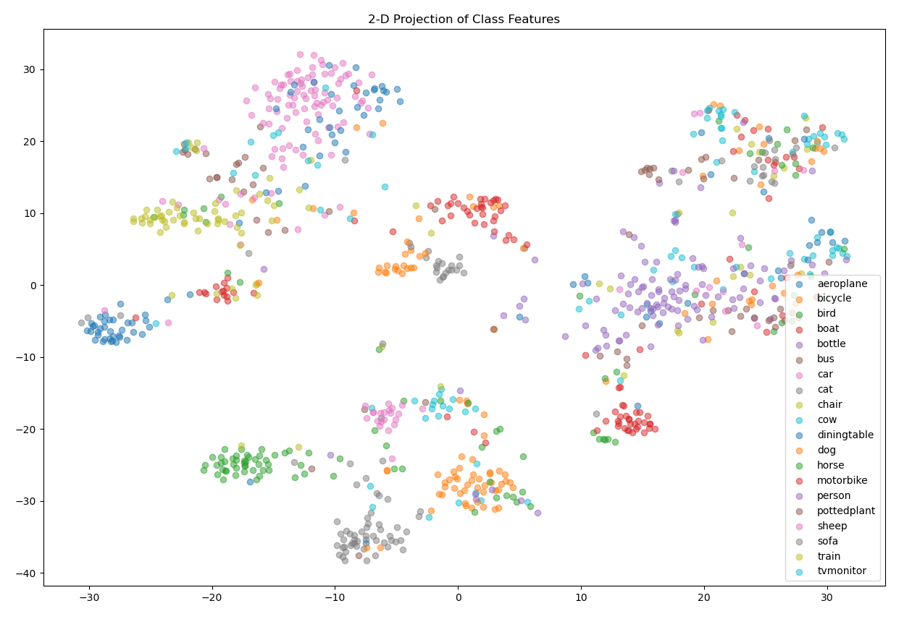
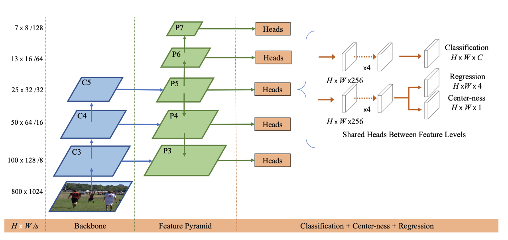
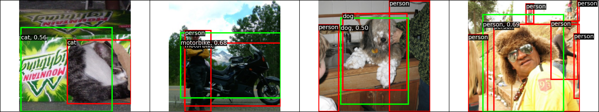

# Look Once Detect All
This repository contains the codes to build and implement ConvNet based models for
* Image Classification
* Image Detection

## Image Classification
Image classification is a fundamental task in computer vision, which involves assigning a label or category to an input image. It plays a crucial role in a wide range of applications, such as object detection, facial recognition, and more. In this project, I have developed a deep learning model using Convolutional Neural Networks (CNN) to perform image classification. 

### Task and Dataset
For this image classification task, [PASCAL VOC 2007](http://host.robots.ox.ac.uk/pascal/VOC/) dataset has been used. This dataset contains a diverse set of images, each belonging to one of several predefined categories. The goal is to train a model that can accurately classify these images into their respective categories.

I implemented two CNN models for this task:

* Simple CNN: A basic CNN architecture was designed, although it achieved relatively lower accuracy and mAP (mean Average Precision) compared to the second model.
* ResNet18 with Linear Probing: I also experimented with using a pre-trained ResNet18 model that was originally trained on the 'IMAGENET1K_V1' dataset and linear probing it. This approach, Linear Probing is generally better than full fine tuning as it involves training only the final classification layer while keeping the pre-trained weights of the model freezed. This not only speeds up training but also helps in preserving the knowledge acquired by the model during its pre-training phase. The training strategy invovled using a very small learning rate (5e-5). This choice of learning rate was deliberate, as it helps in fine-tuning the model's parameters without dramatically altering the pre-trained model's weights. This strategy is particularly useful when working with pre-trained models to ensure that the valuable features learned during pre-training are retained.

### Feature Understanding
To understand the feature space of the Linear probed ResNet-18 model and how it is able to classify and label the images, a 2D projection using t-SNE (T-distributed Stochastic Neighbor Embedding) of the activations of the final block before the fully connected layer were plotted. The below graph shows this projection which illustrates how the model is able to linearly seperate the classes by projecting them in different embedding spaces. An interesting thing to note here is that similar classes (Animal like dog, horse, sheep, cat etc.) are closer to each other than to other classes.

## Image Detection
Object detection is a critical computer vision task, with numerous applications such as autonomous driving, surveillance, and content-based image retrieval. This project implements the research paper **[FCOS: A simple and strong anchor-free object detector](https://arxiv.org/abs/2006.09214)**. FCOS (Fully convolutional one-stage) technique is an anchor-free methodology that simplifies the detection process greatly increasing the speed of detection while maintaining high accuracy. I used pre-trained RegNetX-400MF model as the backbone for implementing the detection network.

## Task and Dataset
The primary task of this project is object detection, which involves identifying and localizing objects within an image, drawing bounding boxes around them. [PASCAL VOC 2007](http://host.robots.ox.ac.uk/pascal/VOC/) dataset which is a widely-used benchmark for object detection is used. This dataset comprises a diverse set of images with objects belonging to several predefined categories. The goal is to detect these objects, predict their class labels, and provide precise bounding box coordinates.

## Model Architecture
Backbone: RegNetX-400MF
For the backbone of our object detection model, RegNetX-400MF model was used. RegNets are a class of efficient and powerful models specifically designed for computer vision tasks. The "400MF" variant of RegNetX signifies its depth and capacity, making it well-suited for object detection.

## FCOS: Anchor-Free Object Detection
FCOS (Fully convolutional one-stage) is an achor-free object detection technique. Unlike traditional anchor-based methods, FCOS is anchor-free, making it simpler and more effective. It assigns bounding boxes to objects by regressing from object centers to box corners. The below image (borrowed from the original paper) illustartes the FCOS approach.

**Note: The original FCOS model uses shared stem for centerness and classification. Recent follow-up papers commonly place centerness and box regression predictors with a shared stem, which we follow here. **

## Evaluation
The trained model was evaluated on mAP (mean Average Precision) and its losses (centre loss, box loss and class loss). The below image shows model detecting images.

